# GUI-DAC
A web application that allows you to create configuration diagrams using both mouse operations and code editing.
# 構成図エディタ GUI-DAC (ジーユーアイ・ダック)

## GUI-DACとは

- マウスによる操作とコード編集の両方を使い構成図を作成できるWebアプリです。
- 個人開発です。

## GUI-DAC作成の動機

- 構成図をコードで表現する技術Diagram as Code (DaC)とDaCツールに魅力を感じたのですが、好みのDaCツールが見つけられなかったので作ることにしました。

## GUI-DACの特徴

- 良い点、悪い点の両方を紹介します。

### よさげなところ

- GUI-DACの良い点について

#### 無限大のキャンバスサイズ

- キャンバスとは、構成図を描画する領域のことです。
- GUI-DACは、この領域がほぼ無限大です。
- そのためキャンバスのサイズを気にせず構成図を作図できます。

#### アカウント登録不要

- GUI-DACはアカウント登録の機能がありません。

#### 構成図をテキストデータで保存できる

- GUI-DACで作成した構成図は、テキスト形式のデータとして保存できます。

#### 配置を自由に決められる

- GUI-DACは構成図ないの図の配置をユーザーが決めることができます。
- 構成図をコードで表現する技術をDiagram as Code (DaC)といい、ツールも多数存在します。
- (勘違いかもしれませんが)それらDaCツールは配置編集についてユーザーの自由度が低いようです。
- GUI-DACは配置情報(x,y座標)を実装したことで、ユーザーが自由に配置を決めることができます。


### 気になるところ

- GUI-DACの悪い点について

#### JSONの知識が必要

- 構成図の情報はJSON形式でまとまっています。
- そのためJSON形式のデータを理解できる知識が必要です。

#### 進化・改善がおそい

- GUI-DACは個人開発です。
- やる気になったときに開発します。
- そのためいつ対応するか予定を立ててません。

#### バグ修正は努力目標

- GUI-DACは個人開発です。
- そのためバグ対応はそれなりです。
- 先に謝っておきます、すみません。


#### 素早い操作はオススメしない

- マウス操作では素早い操作はしないことをオススメします。
- 素早く操作すると、配置が崩れる場合があります。

## 使い方

- コードでオブジェクトを追加し、マウスで図を移動する。これが基本的な操作方法です。

### GUI-DACアプリの画面説明

#### コード(Code)ボタン

- 構成図の情報はJSON形式のテキストデータです。そのテキストデータの表示／非表示を切り替えるボタンです。
- テキストデータを表示した状態では、マウスによる図の修正はできません。

#### 反映ボタン

- `コード(Code)`ボタンにより表示したテキストデータは編集できます。
- `反映`ボタンにより編集したデータを構成図に反映できます。
- ※テキストデータを編集する際は、JSON形式を崩さないこと、誤ったパラメータを指定しないよう注意ください。

#### ファイルを選択ボタン

- ローカルの環境にある構成図の情報を選択し、構成図を描画します。

#### 構成図の保存について

- GUI-DACには構成図の情報を保存する機能はありませんが、保存は可能です。
- 構成図の情報のテキスト情報を表示し、その情報をテキストファイルにコピーすることで保存できます。
- テキストファイルの拡張子は`.json`とするといいかもしれません。
- 構成図の情報のテキスト情報を表示には、`コード(Code)`ボタンを使用します。
- 保存したデータは、`ファイルを選択`ボタンでGUI-DACに読み込むことができます。


### オブジェクトについて

- GUI-DACでは、1つの四角形とそれに付随する画像やテキストを1つのオブジェクトとして扱います。
- そのためGUI-DACで構成図をつくる場合は、オブジェクトの作り方を理解する必要があります。


#### オブジェクトの作成／削除

- オブジェクトの作成および削除は、コード修正で行います。
- コードは、`コード(Code)`ボタンにより表示されるテキストエリアで修正します
- 修正したコードは、反映ボタンにより構成図に反映されます

#### オブジェクトのパラメータ

オブジェクトのパラメータ設定例と各パラメータの意味を説明する。

||記載例|説明|
|---|---|---|
|1|      "label": "AWS01",        |      "label": "{1つの構成図の中で一意の文字列}", |
|2|      "ns": "0123456789",      |"ns": "{構成図に表示する文字列}", |
|3|      "x": 500,                |"x": {X座標}, |
|4|      "y": 170,                |"y": {Y座標}, |
|5|      "w": 1240,               |"w": {幅}, |
|6|      "h": 1000,               |"h": {高さ}, |
|7|      "color": "none",         |"color": "{色}",  |
|8|      "opacity": "1.0",        |"opacity": "{透明度 0.6 なら60%}", |
|9|      "group": "gr0"           |"group": "{グループ名}"|
|10|      "child-layers": [        |"child-layers": [|
|11|        "gr1",                 |        "{子要素になるグループ名}", |
|12|        "gr1",                 |        "{子要素になるグループ名}", |
|13|        "gr3",                 |        "{子要素になるグループ名}",|
|14|        "gr4"                  |        "{子要素になるグループ名}" |
|15|      ],                       |      ],|
|16|      "child": [],             |      "child": ["{子要素になったグループ名：自動設定}"],|
|17|      "line": "#000000",       |      "line": "{線の色。noneで線なし}",|
|18|      "imgTL": "aws.png",      |      "imgTL": "{左上に配置する画像。NONEで指定なし}",|
|19|      "imgTR": "NONE",         |      "imgTR": "{左上に配置する画像。NONEで指定なし}", |
|20|      "imgBL": "NONE",         |      "imgBL": "{左上に配置する画像。NONEで指定なし}",|
|21|      "imgBR": "NONE",         |      "imgBR": "{左上に配置する画像。NONEで指定なし}",|
|22|      "imgCE": "NONE",         |      "imgCE": "{左上に配置する画像。NONEで指定なし}",|
|23|      "imgCL": "NONE",         |      "imgCL": "{左上に配置する画像。NONEで指定なし}", |
|24|      "imgCR": "NONE",         |      "imgCR": "{左上に配置する画像。NONEで指定なし}",|
|25|      "imgCT": "NONE",         |      "imgCT": "{左上に配置する画像。NONEで指定なし}",|
|26|      "imgCB": "NONE",         |      "imgCB": "{左上に配置する画像。NONEで指定なし}", |
|27|      "imgSize": 2,            |      "imgSize": {配置する画像の倍率。2 なら2倍},|
|28|      "txtPosition": "txtTL"   |      "txtPosition": "{文字列 ns の表示位置。txtTLは左上。txtCEは中央}"|


- label要素について
    - プログラムはこのlabel要素でオブジェクトを区別しています。
    - そのためlabel要素の値は1つの構成図の中で一意の文字列にしてください。
- group要素について
    - オブジェクトはグループ名によってグループ化されています。
    - 同じグループのオブジェクトは重なりません。
    - オブジェクト移動で同じグループのオブジェクトに衝突すると、そのオブジェクトを押し出します
- child-layers要素について
    - 子要素とするグループ名を指定します。
    - 子要素は複数指定できます。
    - オブジェクトの内部に子要素のグループに属するオブジェクトがある場合、そのオブジェクトは子要素となります。
- child要素について
    - 子要素と判定されたオブジェクトのlabel値が登録されます。
    - child要素はプログラムが使用するため、ユーザーは編集不要です。
- line要素について
    - 線の色を指定します。
    - 色の指定は、HTMLカラーコードが使えます
        - 例 black, #000000
    - none と記載すると線なしになります。
- imgXX要素について
    - オブジェクトの指定の位置に画像を配置します。
    - 配置できる画像は`parts`フォルダ内の画像ファイルです
    - NONEを指定すると画像なしになります
    - imgTLのTLは、TopLeft=左上 です。
    - TopRight=右上、BottomLeft=左下、といった感じです。
    - CE はCenter=中央です。


#### オブジェクトの移動

- オブジェクトは、コードでもマウスでも移動できます。
- コードの場合は、移動したいオブジェクトのx要素,y要素を編集します。
- （編集したコードは`反映`ボタンで反映します）
- マウスの場合は、移動したいオブジェクトを選択し、ドラッグします。


#### オブジェクトのサイズ変更

- オブジェクトは、コードでもマウスでもサイズ変更できます。
- コードの場合は、サイズ変更したいオブジェクトのw要素,h要素を編集します。
- （編集したコードは`反映`ボタンで反映します）
- マウスの場合は、移動したいオブジェクトを選択します。
- 選択したオブジェクトの四隅にある小さな円のうち、右上、左下、右下のいずれかをドラッグするとサイズが変更できます。
- 右上の円をドラッグすると、幅(w要素)を変更できます。
- 左下の円をドラッグすると、高さ(h要素)を変更できます。
- 右下の円をドラッグすると、幅(w要素)と高さ(h要素)の両方を変更できます。

#### オブジェクトのサンプルファイル

- サンプルはこちらにあります。
    - `samples/02_オブジェクトサンプル_rule2024-07-21.json`


### 接続線

- GUI-DACでは、オブジェクトをつなぐ線を描画できます。
- この線を線オブジェクトといいます。
- 線オブジェクトは、通信経路や処理経路の表現に使用できます。

#### 接続線の作成／削除

- 線オブジェクトの作成および削除は、コード修正で行います。
- コードは、`コード(Code)`ボタンにより表示されるテキストエリアで修正します
- 修正したコードは、反映ボタンにより構成図に反映されます


#### 接続線のパラメータ


||記載例|説明|
|---|---|---|
|1|      "id": "n001",              |"id": "{1つの構成図の中で一意の文字列}",
|2|      "color": "#129934",        |"color": "{色}",
|3|      "opa": 1,                  |"opa": {透明度 0.6 なら60%},
|4|      "aline": 2,                |"aline": {線の幅},
|5|      "cirSize": 0.8,            |"cirSize": {円の大きさ},
|6|      "angle": 0,                |"angle": {線},
|7|      "lineGap": "2,2",          |"lineGap": "{破線の設定 実線の幅,空白の幅}",
|8|      "cirStrokeWidth": 0.05,    |"cirStrokeWidth": 円の線幅,
|9|      "conns": [                 |"conns": [
|10|        "igw01",                 |"{label値}",
|11|        "ALB01",                 |"{label値}",
|12|        "EC201",                 |"{label値}",
|13|        "RDS01"                  |"{label値}"
|14|      ]                          |]


- id要素について
    - プログラムはこのid要素で線オブジェクトを区別しています。
    - そのためid要素の値は1つの構成図の中で一意の文字列にしてください。
- angle要素について
    - angle要素は複数の接続線が重複する際に、重複を回避する際に使用します。

- lineGap要素について
    - 破線の設定をします。
    - 実線の幅,空白の幅 と数値を指定します。
    - 例：実線 3, 空白 4 の場合　`"3,4"`
- conns
    - 接続するオブジェクトのlabel値を設定します。
    - オブジェクトは2つ以上設定する必要があります。


#### 線オブジェクトの移動

- 線オブジェクトはconns要素で指定したlabelのオブジェクトを移動することで線も移動します。
- （オブジェクトの移動方法については、"オブジェクトの移動"を参照ください）

#### 接続線のサンプルファイル

- サンプルはこちらにあります。
    - `samples/03_接続線サンプル_rule2024-07-21.json`

### 複数オブジェクトの移動について

- GUI-DACでの複数のオブジェクトの移動について説明します。
- 複数のオブジェクトをまとめて移動する場合はマウス操作が便利です。


#### オブジェクトの親子関係について

- GUI-DACでは、オブジェクト間に親子関係があります。
- 親子関係は、オブジェクトの設定と位置関係で決まります。

#### 親子関係の決定について

- オブジェクトの`"child-layers"`要素に記載されたグループ名が関係します。
- 記載されたグループ名に属するオブジェクトが、そのオブジェクトの子要素になる可能性があります。
- あとは位置関係、子要素になる可能性があるオブジェクトが、対象オブジェクトの中にあると、子要素になります。
- 位置関係については、対象オブジェクトの中にある子要素が移動し、対象オブジェクトの外になると子要素から外れます。

#### 子要素をもつオブジェクトの移動について

- 子要素を持つオブジェクトをマウス操作で移動すると、子要素も移動します。


#### 他オブジェクトの押し出しについて

- GUI-DACはオブジェクト移動で他オブジェクトに近づくと重なりを防ぐため押し出しが発生することがあります。
- 押し出しが発生するかはそれらオブジェクトの設定により決まります。

#### 押し出しが発生する条件について

- 押し出しが発生する条件はそれらオブジェクトの`group`要素と`child-layers`要素で決まります。
- 押し出しが発生する条件は2通りあります。
- ＜押し出しが発生する条件＞
    - `group`要素が同じ
        - 衝突するオブジェクトが同じ`group`要素の場合、押し出しが発生します。
    - 衝突するオブジェクトが`child-layers`要素に含まれる
        - 移動するオブジェクト、衝突するオブジェクトについて、移動するオブジェクトの`child-layers`要素に衝突するオブジェクトの`group`値がある場合、押し出しが発生します。

#### 押し出しのサンプルファイル

- サンプルはこちらにあります。
    - `samples/04_押し出し_移動サンプル_rule2024-07-21.json`


-----------------------


## サンプルで使い方を説明

- サンプルを使い具体的なパラメータの設定方法を紹介します。

## サンプルで使い【オブジェクト】を説明

- サンプル`samples/02_オブジェクトサンプル_rule2024-07-21.json`を使いオブジェクトについて説明します。
- このサンプルをGUI-DACで開くとこのような構成図が描画されます。

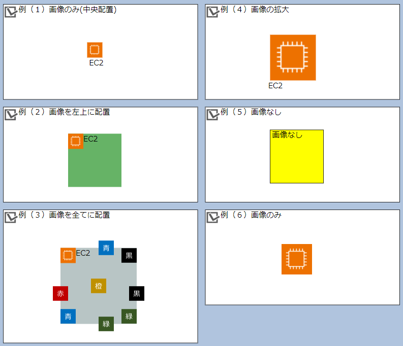

- 例（１）画像のみ(中央配置)

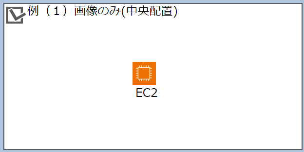

オブジェクトの中央に画像(`ec2.png`)を配置し、四角形の線や面の色を透明(`none`)にしています。

```json
    {
      "label": "EC2-01",
      "ns": "EC2",
      "x": 1050,
      "y": 330,
      "w": 40,
      "h": 40,
      "color": "none",
      "opacity": "1.0",
      "group": "gr3",
      "child": [],
      "line": "none",
      "imgTL": "NONE",
      "imgTR": "NONE",
      "imgBL": "NONE",
      "imgBR": "NONE",
      "imgCE": "ec2.png",
      "imgCL": "NONE",
      "imgCR": "NONE",
      "imgCT": "NONE",
      "imgCB": "NONE",
      "imgSize": 1,
      "txtPosition": "txtCE"
    }
```

- 例（３）画像を全てに配置

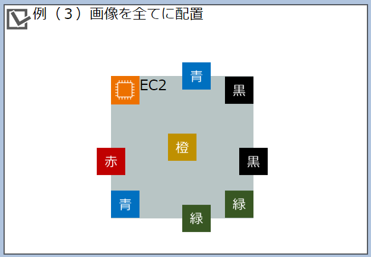

オブジェクトに設定できる全てのポジションに画像を配置するとこのようになります。
コードをみると imgXXの全てに画像ファイル(xxx.png)を指定していることが分かります。

```json
    {
      "label": "EC2-03",
      "ns": "EC2",
      "x": 560,
      "y": 890,
      "w": 200,
      "h": 200,
      "color": "#899F9F",
      "opacity": "0.6",
      "group": "gr3",
      "child": [],
      "line": "none",
      "imgTL": "ec2.png",
      "imgTR": "sBlack.png",
      "imgBL": "sBlue.png",
      "imgBR": "sGreen.png",
      "imgCE": "sOrange.png",
      "imgCL": "sRed.png",
      "imgCR": "sBlack.png",
      "imgCT": "sBlue.png",
      "imgCB": "sGreen.png",
      "imgSize": 1,
      "txtPosition": "txtTL"
    }
```

- 例（５）画像なし

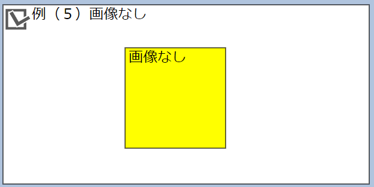

画像なしのオブジェクトを作成することもできます。

```json
    {
      "label": "SOMETHING-01",
      "ns": "画像なし",
      "x": 1090,
      "y": 580,
      "w": 140,
      "h": 140,
      "color": "yellow",
      "opacity": "1.0",
      "group": "gr3",
      "child": [],
      "line": "#000000",
      "imgTL": "NONE",
      "imgTR": "NONE",
      "imgBL": "NONE",
      "imgBR": "NONE",
      "imgCE": "NONE",
      "imgCL": "NONE",
      "imgCR": "NONE",
      "imgCT": "NONE",
      "imgCB": "NONE",
      "imgSize": 3,
      "txtPosition": "txtTL"
    }
```

- 例（６）画像のみ

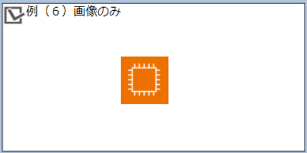

画像のみ（テキストなし）のオブジェクトを作成することもできます。
`ns`要素に値を `""` とするとテキストなしになります。

```json
    {
      "label": "EC2-06",
      "ns": "",
      "x": 1210,
      "y": 1030,
      "w": 80,
      "h": 80,
      "color": "none",
      "opacity": "1.0",
      "group": "gr3",
      "child": [],
      "line": "none",
      "imgTL": "NONE",
      "imgTR": "NONE",
      "imgBL": "NONE",
      "imgBR": "NONE",
      "imgCE": "ec2.png",
      "imgCL": "NONE",
      "imgCR": "NONE",
      "imgCT": "NONE",
      "imgCB": "NONE",
      "imgSize": 2,
      "txtPosition": "txtCE"
    }
```

## サンプルで使い【接続線】を説明

- サンプル`samples/03_接続線サンプル_rule2024-07-21.json`を使いオブジェクトについて説明します。
- このサンプルをGUI-DACで開くとこのような構成図が描画されます。

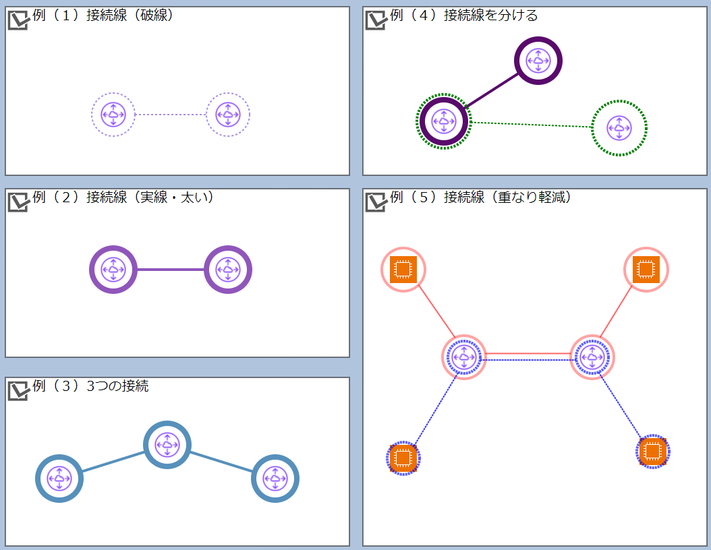


- 例（１）接続線（破線）

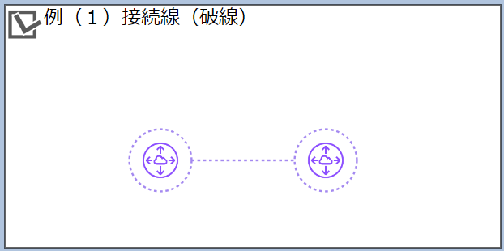

2つのオブジェクトの接続線を引くことができます。

```json
    {
      "id": "n01-01",
      "color": "#a489F0",
      "opa": 1,
      "aline": 2,
      "cirSize": 0.8,
      "angle": 0,
      "lineGap": "3,3",
      "cirStrokeWidth": 0.05,
      "conns": [
        "vpeer-01-01",
        "vpeer-01-02"
      ]
    }
```

以下のように、接続されたオブジェクトを移動すると接続線も移動します。

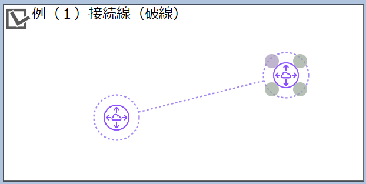


- 例（３）３つの接続

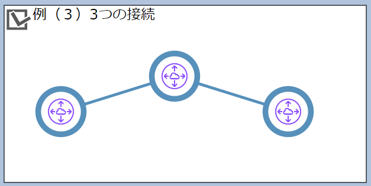

3つのオブジェクトを接続することもできます。`conns`要素にオブジェクトを設定すれば、いくつでも接続できます。

```json
    {
      "id": "n03-01",
      "color": "#5690BB",
      "opa": 1,
      "aline": 4,
      "cirSize": 0.8,
      "angle": 0,
      "lineGap": "3,0",
      "cirStrokeWidth": 0.2,
      "conns": [
        "vpeer-03-01",
        "vpeer-03-02",
        "vpeer-03-03"
      ]
    }
```

- 例（４）接続線を分ける

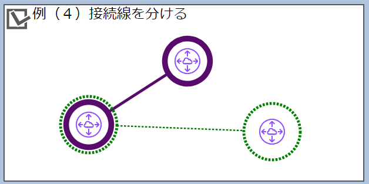

オブジェクトAとBの接続と、オブジェクトAとCの接続を分けたい場合は2つの接続線を作成します。


```json
    {
      "id": "n04-01",
      "color": "#590B6B",
      "opa": 1,
      "aline": 4,
      "cirSize": 0.8,
      "angle": 0,
      "lineGap": "3,0",
      "cirStrokeWidth": 0.2,
      "conns": [
        "vpeer-04-01",
        "vpeer-04-02"
      ]
    },
    {
      "id": "n04-02",
      "color": "green",
      "opa": 1,
      "aline": 2,
      "cirSize": 1,
      "angle": 0,
      "lineGap": "3,2",
      "cirStrokeWidth": 0.1,
      "conns": [
        "vpeer-04-01",
        "vpeer-04-03"
      ]
    }
```


- 例（５）接続線（重なり軽減）

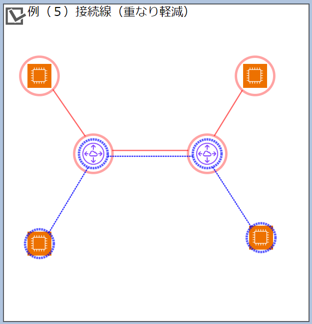

同じ経路を通る異なる接続線について、それら接続線の重なりを軽減します。
これはそれぞれの接続線の `angle`要素の値を異なる値にしています。

```json
    {
      "id": "n05-02",
      "color": "red",
      "opa": 0.6,
      "aline": 2,
      "cirSize": 0.8,
      "angle": 10,
      "lineGap": "3,0",
      "cirStrokeWidth": 0.1,
      "conns": [
        "ec2-05-01",
        "vpeer-05-01",
        "vpeer-05-02",
        "ec2-05-02"
      ]
    },
    {
      "id": "n05-03",
      "color": "blue",
      "opa": 0.8,
      "aline": 2,
      "cirSize": 0.6,
      "angle": -10,
      "lineGap": "3,1",
      "cirStrokeWidth": 0.1,
      "conns": [
        "ec2-05-03",
        "vpeer-05-01",
        "vpeer-05-02",
        "ec2-05-04"
      ]
    }
```


`angle`要素の値は、以下の図で示すところの角度であり、単位はラジアンです。

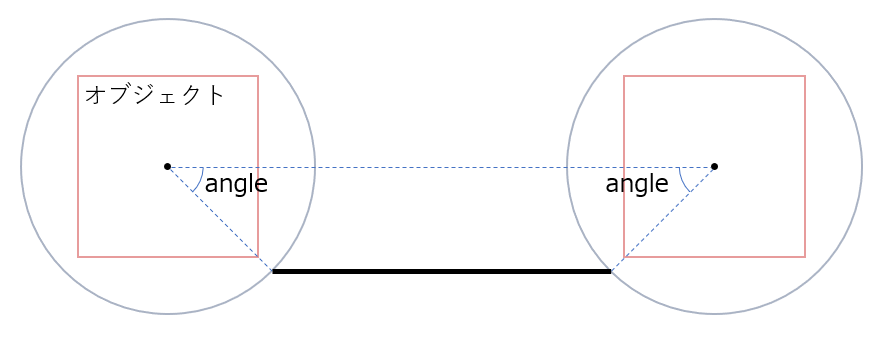


例えば`angle`要素の値を同じ値 (`0`)にするとこのように接続線の重なる箇所が増えます。

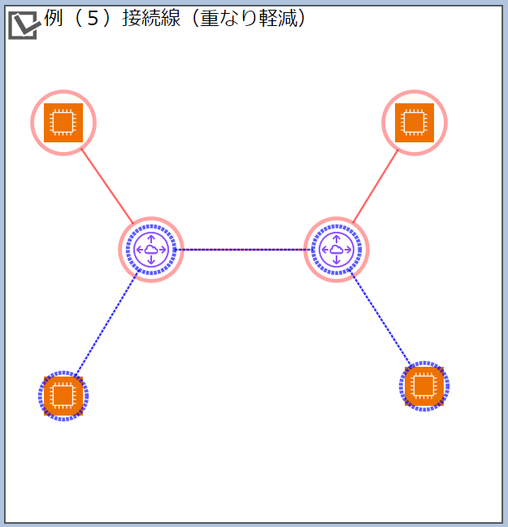


## サンプルで【押し出し】を説明

- サンプル`samples/04_押し出し_移動サンプル_rule2024-07-21.json`を使いオブジェクトについて説明します。
- このサンプルをGUI-DACで開くとこのような構成図が描画されます。

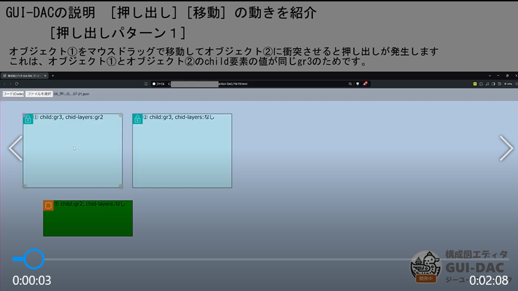


- オブジェクト①を移動してオブジェクト③に衝突させると押し出しが発生します


- オブジェクト③を移動してオブジェクト①に衝突させると押し出しが発生しません

- オブジェクト②を移動してオブジェクト③に衝突させると押し出しが発生しません

- オブジェクト③を移動してオブジェクト②に衝突させると押し出しが発生しません


- オブジェクト③がオブジェクト①の中にある場合に、オブジェクト①を移動するとオブジェクト③も移動する

- オブジェクト③がオブジェクト②の中にある場合に、オブジェクト②を移動してもオブジェクト③は移動しない


